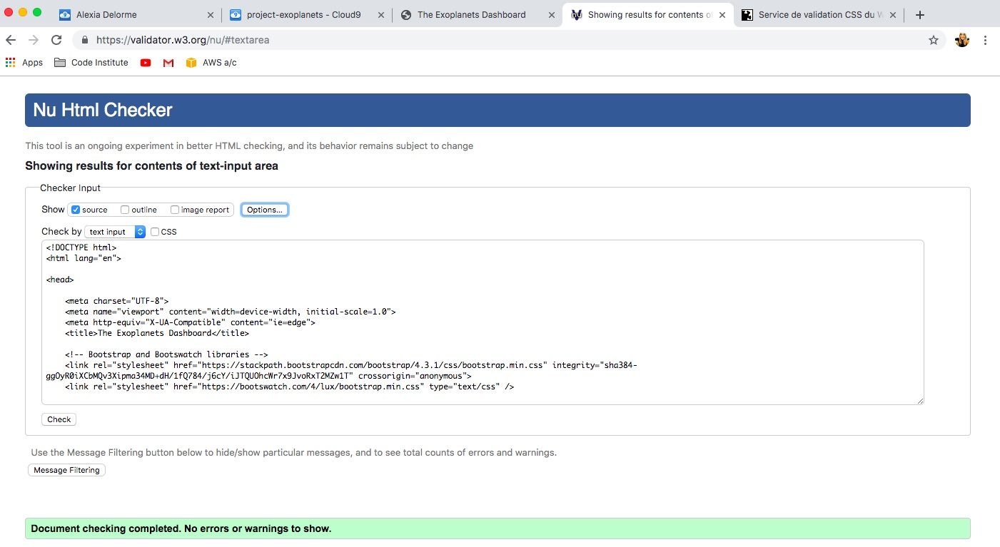
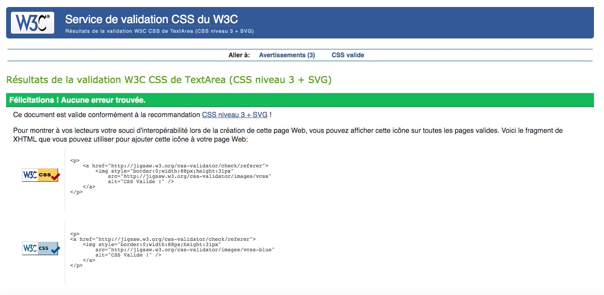

# Exoplanets Dashboard

This is a single page dashboard presenting data on the most recent (and confirmed) exoplanets published by the [NASA Exoplanet Science Institue](https://exoplanetarchive.ipac.caltech.edu/index.html).The data were thouroughly selected and displayed to allow users without background in Astrophysics to easily understand and analyse it.

The dashboard was built using DC.js, D3.js and crossfilter.js libraries to present the data through different chart types : pie charts, bar/row charts, scatter plot and finally a recap table. 

The interface enables the user to collect diverse information related to the detection of the exoplanets, the years they were discovered, and get some simple features as well as correlations regarding the planets and their hosting stellar. The user has the option to filter exoplanets thanks to a modal form so that he/she can isolate specific planets based on chosen criteria. A recap data table is presented at the bottom of the page to provide the user with additional relevant information on individual planets in the sample (such as the hosting stellar name, distance...). 

The current deployed version can be found at [here](https://alexiadelorme.github.io/project-exoplanets/).

## UX

This dashboard is built for users who have an interest in Astrophysics and specifically exoplanets and would like to quickly analyze and collect information on the most recent and confirmed exoplanets published by the NASA Exoplanet Science Institute. 

It allows users to refine a large sample of more than 3900 exoplanets thanks to a simple modal form. They can decide what type of charts they want to display and/or filter on specific criteria to analyse data in a simple and flexible manner. Based on their selection, users can visualize aggregated charts and can also have access - through a data table - to specific features for each individual planets in the sample .
 
### User Stories
 
###### User story 1
 
 - As a user, I want to have access to a clear and simple dashboard for a large sample of exoplanets without having to go through a spreadsheet with equivocal column fields and without any hierarchy in the data. 
 - This way I have a glimpse of the general information and trends on exoplanets in an aggregated format. 

###### User story 2

- As a user, I want to be able to filter according to some features related to either the discovery of the exoplanets (years of discovery, detection method or facility), or analyse data for exoplanets inside/outside the Kepler scope (ie. exoplanets detected during the Kepler mission), choose the type of data, and be able to keep only correlations that are relevant to my analysis. 
- This will enable me to refine my analysis according to some chosen criteria.

###### User story 3

- As a user, I want to easily identify information related to the exoplanet discovery: when was it discovered, how (method of detection), where (from space or from earth), from what entity it was discovered - and also to acess some of their features such as their orbital period and other information related to their planetary system.
- This will enable me to refine my analysis and extend my knowledge on the exoplanets contained in my sample. 

###### User story 4

 - As a user, I want to be able to access scatter plots on some features of the exoplanets.
 - This way, I can identify correlations and be able to confirm/infirm some hypothesis on planets.

###### User story 5

- As a user, I want to have access to information for individual planets either for the whole sample or for a sample based on some specific criteria.

###### User story 6

- As a user, I want to be able to reset the entire dashboard without having to manually reload the page, reclick on any chart, or re-enter the modal form. Or, I would like to re-enter the modal form without having to scroll up to the home page. 

### Wireframes

 
## Features

### Current Features

###### Feature 1 - Home page and modal form
- On the home page, when the button "Start Here" is clicked, a modal form window popped up. 
- The modal form enables the user to refine its sample by adding filters on various criteria (regarding the detection of the planet).
- The modal form also enables the user to select if he/she wants to display the data table (gathering individual information on the planets), the type of data to plot (cumulative or non-cumulative), what correlations graph to display. 
- The "Reset Filters" button on modal form achieves the same goal as the one on the navigation bar (they share the same class). It enables the user to reset filters directly when the modal form is opened. It prevents the user from having to exit the modal form, clicks the reset button, and then reopens the form. 
- The "Save & Close' button on modal form enables the user to exit the modal and be directly redirected to the dashboard section.

###### Feature 2 - Navigation bar with "Reset Filters" button 
- The navigation bar contains (from left to right):
    * The name of the website that when clicks redirect to the data dashboard.
    * Each navigation item in the nav menu returns to a specific section in the data dashboard.
    * The "Reset Filters' button enables the user to reset filters for the entire dashboard as well as setting back to the default parametres for the modal form.
    * The "Restart Here" button enables the user to re-open the modal form when the user has scrolled down and the home page is no longer on screen. This prevents the user from having to click "home", or from scrolling back up to the home section to reopen the modal form. 
- The navigation bar is fixed to the top which enables the user to access any section of the dashboard without scrolling up or down. This is very useful especially if the user is working on a large sample and checking at particular data in the table.

###### Feature 3 - Introduction box
- The introduction jumbotron box provides the user with information regarding exoplanets and definition. 
- The user can click the "Learn More" button to read more information on the NASA website.
- The user is also provided with the link of my data source "NASA Exoplanet Archive" to investigate further on available data. 

###### Feature 4 - Stat on the sample
- The user is provided with general figures on the sample in an aggregated format which enables him/her to understand the scope of its sample.
- Here is a list of what information are given: 
    * the total number of planets in the sample,
    * the average stellar age, (TO BE FIXED),
    * the percentage of planets that were (or were not) discovered during the Kepler mission, 
    * the percentage of planets that were discovered from space or ground. 

###### Feature 5 - Discovery section
The discovery section groups all the charts related to the discovery of the planets.
- discovery location - pie chart: it provides the user with the proportion of planets that were detected from devices loacated on earth, on space, or both. 
- discovery facility - pie chart: it provides the user with the breakdown of planets (in %) by observatory. As the number of observatory entities is quite significant, the chart only shows the top 8 observatory facilities to improve readibility (the rest are flagged under "others"). 
- detection method - row chart: it provides the user with the number of planets that were detected by a specific method. There is a total of 7 distinct detection methods reprensented. 
- detection by year (cumulative or non-cumulative) - bar chart: this is a stacked bar chart that provides the number of planets discovered by year with a breakdown by detection method. To improve user experience, the same colour chart was used for the "detection method" row chart and this "detections by year" bar chart. The user can see the data on a cumulative or non-cumlative basis according to the data type he/she chose in the modal form. By default, it is set to non-cumulative. 

###### Feature 6 - Features section
The features section groups all the charts related to the features of the planets.
- orbital period - bar chart: it groups the number of planets according to their orbital period ranging from period < 1 day to > 1 year. 
- number of planets in system - line graph: this graph shows the number of planets for which we have identified (or not) other planet(s) in the same planetary system. 
- distance to the planetary system - bar chart: it groups the number of planets according to their distance (distance of the hosting stellar from the solar system). It is expressed in "parsecs" which is a unit of distance used in astronomy. 
- stellar age - bar chart: it displays the number of planets according to the age of their corresponding hosting stellar. 

###### Feature 7 - Correlations section
- This section is composed of three scatter plot charts that provide the user with two-dimensional representation between certain metrics of the planets and its stellar. This enables the user to establish (or not) correlations between some know metrics.
- For each scatter plot, the user has the possibility to identify planets that were (or not) discovered during the Kepler mission.
- As previously said, when the user set filters in the modal form, he/she had the possibility to select what correlations graph to display.
- Axes are labelled and the unit of measure is given to the user so it cannot get confusing. 
- The user has the possibility to point out to a specific plot and have information for the two dimensions for this specific planet. 
- The following metrics are represented:
   * Correlation 1: mass vs radius of the planet, with the mass of the planet reprensented in the x-axis and the radius in the y-axis. Please note that this graph only pertains to planet features. The domain of the x-axis is set using the max and min values but the y-axis was set manually after analysing the data to prevents to avoid the effect of outliers. This increases user readibility and is a process often used in statistical analysis.
   * Correlation 2: planet mass vs. stellar mass, with the planet mass reprensented in the x-axis and the stellar mass in the y-axis. As it was sone for the previous correlation, the x-axis domain was set using max and min values but the y-axis was set manually to avoir outliers effet. 
   * Correlation 3: planet radius vs. stellar radius, with the planet radius reprensented in the x-axis and the stellar radius in the y-axis. As it was sone for the previous correlations, the x-axis domain was set using max and min values but the y-axis was set manually to avoir outliers effet. 

###### Feature 8 - Data Table
- In the modal form, the user can select if he/she wants to display a table with individual information for each planet in the sample. For a better user experience, the data table is by default unchecked as the original sample contains almost 4000 exoplanets so would be a poor user experience to have an endless page. 
- The user therefore have the option to display this data table which might be useful to collect information on individual planets for a smaller sample after applying some specific filters. The user has access to the following data:hosting stellar name (there was no need to display the name of the planets has it is the hosting stellar name + a letter), year of discovery, discovery method, orbital period, stellar distance, and stellar age. 

###### Feature 9 - Footer
The footer section at the bottom of the page provides the user with my name, email address (automatically open an email application on click), a link to my Git account and the link to the [NASA Exoplanet Archive](https://exoplanetarchive.ipac.caltech.edu/index.html) from which I extracted my data. 

### Future Features

Please find below the list of improvements I would like to add to this project:

###### Use API for loading data
- I would like to integrate the NASA API so that the user can update the sample with the latest records available, chose specific coloumn fields for the dataset. 

###### Increase interactivity with user
- Thanks to the previous improvement, I could add more interactivity in the choice of data the user wants to display in the dashboard. For example: instead of chosing between some pre-plotted scatter plots, the user could choose the data he wants to plot for correlations (mass vs. density, orbital period vs. mass etc...). This would add a lot more flexibility and could answer the needs of more advanced audience in Astrophysics.

###### Add indicators on graphs
- I also would like to add markers/indications to provide a referentiel to the user regarding the data that are being displayed (Example: display the age of the sun in the stellar age graph...)

*All those improvements could make my project even more fun to learn from but also could be useful for a wide range of users.*

## Technologies Used

##### [Balsamiq](https://balsamiq.com/) 
- I used Balsamiq to design my wireframes after drawing them manually.

##### [Cloud9](https://c9.io)
- I used Cloud9 as my code editor for HTML, JS and CSS.

##### [HTML5](https://www.w3.org/TR/html/)
- I used HTML for creating the static content of my webpage.
- The following code validator was used to test my HTML code: [HTML](https://validator.w3.org/)

##### [CSS3](https://www.w3.org/Style/CSS/) & [SASS](https://sass-lang.com/)
- I used SASS/SCSS to structure the styling of my webpage and personalize it. My SCSS stylesheets where then mapped to a CSS file using the CLI. 
- The following code validator was used to test my CSS code:  [CSS](https://jigsaw.w3.org/css-validator/)

##### [Bootswatch](https://bootswatch.com/lux/)
- I used Bootswatch Theme Lux to have an elegant template for my website. 

##### [Bootstrap 4](https://getbootstrap.com/)
- I used Boostrap version 4 mostly for the grid system to easily create a responsive website.

##### [JavaScript](https://developer.mozilla.org/en-US/docs/Web/JavaScript)
- I used the following JS libraries combined with some core JS to create data-visualization elements:
    * [D3.js](https://d3js.org/)
    * [DC.js](https://dc-js.github.io/dc.js/)
    * [Crossfilter.js](http://square.github.io/crossfilter/)
* [D3-queue.js](https://github.com/d3/d3-queue) to load the data field in CSV format.
* [jQuery](https://jquery.com/) to simplify the DOM manipulation based on the user input via the modal form or when the reset button is clicked.
* [JSHint](https://jshint.com/) was used to check my JS code quality

##### [Picasa](https://picasa.google.com/)
- I used Picasa to resize and change the orientation of my background image.

##### [ImageOptim](https://imageoptim.com/mac)
- I used ImageOptim to optimize the size my background image. 

##### [Font Awesome](https://origin.fontawesome.com/)
- I used Font Awesome to display icons for the footer of my page.

##### [Git & GitHub](https://github.com/)
- I used Git for version control. 
- I used GitHub to store my code in a remote repository, deploy and host my website.

## Testing 

This site was thouroughly tested manually for the following:
- User stories
- code quality
- compatibility and responsiveness
- Javascript

Please note that all JavaScript files were extensively tested and documented in a separate file that can be found [here](testing/js). 

#### User stories

This project has been tested multiple times against each user stories previously listed in the UX section. 

###### Testing user story 1 

*User story: The user has easy access to aggregated data in a simple a clean fashion.*

Hypothesis: For this test scenario, the user does not filter using the “start here” modal form. This is simply to test the general purpose of the project.

Test scenario:
-	Go to the home page
-	Scroll down to navigate the dashboard, or,
-	Directly click on the “Exoplanets Dashboard” menu item in the navigation bar to be redirected
-	You should be provided with the source of the data, definition of a exoplanet…
-	You should be able to identify general information regarding the sample: total number of planets in the sample, average stellar year…
-	You should be able to identify through the different graphs relevant information regarding the sample. 

Test result: **Successful**

###### Testing user story 2

*User story: For this test scenario, the user can set filters to its sample to tailor the dashboard to a specific need or analysis.*

Hypothesis: the user wants to filter data according to the criteria available in the modal form. 

Test scenario:
- On the home page, click on the “Start Here” button
- A modal form should open
- All the dropdown fields should have the first entry that displays “Select all”
- For the checkboxes, the “Data table” should be by default “disabled” while, the data type should be set to “non-cumulative”. You can enable/disable by clicking on the checkbox.
- You should be able to select planets based on exclusive criteria for:
    - Kepler selector
    - Location of detection
- You should be able to select multiple fields for the following criteria:
    - Years of discovery
    - Discovering facility
    - Discovery method
- The three correlation checkboxes should be, by default, activated. It should be possible to enable or disable displaying these charts by clicking on checkbox.
- You should be able to reset the initial filters of the modal form by clicking on the left white button at the bottom of the modal form “Reset filters”.
- You should be able to close the modal form by clicking the right black button at the bottom of the form “Save & close”. 
-	When modal closed, you should be redirected to the “intro” section giving you the statistics of your sample and then able to scroll down to view the charts with the filters you defined in the modal form. 
- You can also interact on the individual charts themselves if necessary by clicking on them. 

Test result: **Successful**

*Please note that the testing regarding DOM interaction through the modal form is documented in the JS testing.*

###### Testing user story 3

*User story: The user easily identify information related to the discovery and features of the exoplanet without any issues.*

Hypothesis: The user already applied the desired filters (if any) and has scrolled to the dashboard already.

Test scenario:

1st part:
-	Go to the "discovery" section of the dashboard either by scrolling down or clicking on the navigation bar.
-	For this section you should be able to identify 4 charts:
    - Chart 1: you should be able to view a pie chart with the breakdown in % for the discovery location (ground, space or both). The legend should be clear and visible. By pointing on a slice of a chart, the number of planets should appear in a box. 
    - Chart 2 : you should be able to view a pie chart with the breakdown in % for the discovery facility. Information should be displayed only for the 8 top discovery facility. The legend should be visbile and easy to read, the rest of the facility discoveries should be flagged under the label "others". By pointing on a slice of a chart for a specific facility, the number of planets should appear in a box. By clicking the "?" icon, you should be redirected to a link, that opens in a new tab, to the wikipedia page for the different types of detection method for exoplanets.
    - Chart 3 : you should be able to view a row bar chart with the number of planets by detection method. The same information should also be visible when clicking on a specific bar. 
    - Chart 4 : 
        - For non-cumulative data: you should be able to view a stacked bar chart (for non-cumulative data) with the number of detections per year. A breakdown by detection method should also be visible and the colours of the method should be consistent with the previous chart.
        - For cumulative data: you should be able to view a bar chart with the cumulative number of planets discovered for each year. This bar chart is not stacked as I didn't find a way to stack it with the function used to accumulate the data. This is part of the "know issues" and should be fixed as part of future features.

2nd part:
- Go to the "features" section of the dashboard either by scrolling down or clicking on the navigation bar.
- For this section you should be able to identify 4 charts:
    - Chart 1: you should be able to view a bar chart for orbital period. For each interval period, you should view the total number of planets. By clicking the "?" icon next to the chart title, a small paragraph providing a simple definition of the orbital period should appear after the title. Clicking the icon back should make the paragraph disappear. 
    - Chart 2: you should be able to view a line chart providing the number of planets associated to each planetary system (ranging from 1 discovered planet in the system to up to 8 planets discovered for an associated planetary system). By pointing on the line chart, you should be able to have the total number of planets apearing in a box. 
    - Chart 3: you should be able to view a bar chart with the number of planets by interval distance. For each interval, the total number of planets in this tranche should be visible. By clicking the "?" icon next to the chart title, a small paragraph explaining the "parsecs" unit of measure should appear, this paragraph should dispappear when clicked back.
    - Chart 4: you should be able to view a bar chart with the number of planets by interval age. For each interval, the total number of planets in this tranche should be visible. 

Test result: **Successful**

###### Testing user story 4

*User story: The user can identify correlations to verify an hypothesis on exoplanet metrics.*

Hypothesis: The user should not deselect any correlation graphs in the modal form to perform this test. 

Test scenario:
- Click on the "Correlation" menu item
- There should be 3 scatter plots
- For each scatter plot, there should be:
    - a clear title to identify the metrics
    - the x-axis and the y-axis should be labelled. The axis labes should also specify the units (examples: in earth masses)
    - the scales should be linear and easy to read 
    - there should be a legend to distinguish planets from the Kepler scope and planets outside the Kepler scope
    - when pointing at a specific plot, there should be a box specifying the two dimensions for this specific planet (example: Planet Mass = 400 - Stellar Mass = 2)
- The graph should be scaled appropriately 
- You should be able easily identify if there a correlation can be identified between the two dimensions plotted. 

Test result: **Successful**

###### Testing user story 5

*User story: The user can access information on individual planets when choosing to display the data table in modal form.*

Hypothesis: The user does not apply any specific filter to the sample

Test scenario:
-	Open the modal form by clicking the "Start here" button
-	Enable the data table and exit the modal form
-	A data table item should have appeared in the navigation bar
-	Click on this menu item
-	You should be redirected to a section named "Information about the selected planets"
-	Information about each individual planets in the sample should be visible (hosting stellar name, years of discovery, discovery method...)
-	If a data is missing in the table, it should display "N/A"

Test result: **Successful**

###### Testing user story 6

*User story: The user can reset the entire dashboard or re-enter the modal form anytime.*

Hypothesis: The user already applied filters in the modal form. 

Test scenario:
- Click on the white "Reset filters" button in the right of the fixed navigation bar.
- This should remove all filters applied to the dashboard that was previously set in the modal form. 
- Scroll down to pass the home page, as soon as you hit the "intro" section, a black "Resart here" button should appear in the navbar (next to the white button )
- Clicking this button should enable you to re-open the modal form without scrolling back to the home page.

Test result: **Successful**

#### Code quality

##### HTML5

index.html file succesfully passed this [HTML code validator](https://validator.w3.org/) by direct input as per screenshot provided down below.

##### CSS3

main.css file succesfully passed this [CSS code validator](https://jigsaw.w3.org/css-validator/) by direct input as per screenshot provided down below.

##### JS

Details about code validation for JS files have been provided in the testing section dedicated to JS, in the following folder: [testing/js](testing/js). 

#### Compatibility & Responsiveness

A cross browser testing was performed for each user stories scenario to ensure that all functionalities render well in different browsers:
- Safari
- Google Chrome
- Mozilla Firefox
- Internet Explorer
- Opera 

The responsiveness of the webiste was tested thanks to Google Chrome developer tool, the following devices size were tested and all elements were display without issued:
- Galaxy S5 
- Pixel 2 / Pixel 2 XL 
- iPhone 5/SE / iPhone X 
- iPhone 6/7/8 and Plus
- iPad / iPad Pro 

#### JS Testing

There is an entire section dedicated to the testing of JS files [here](testing/js/JSTEST.md). 

### Known Issues - TO BE DONE

* Number of planets in planetary system: TO BE EXPLAINED - find a way to display number of planetary system and not number of planets
* Stellar Age chart: the total number of planets displayed in this graph is significantly inferior to the total number of planets in the sample as we were missing the stellar age for almost half of the data in the sample. 
* Stellar age roundings in data table: it only displays 2 decimals but since the measure of units is Giga Year, for young stellars, it displays "0.00". 

## Deployment

I used the Cloud 9 IDE to develop my projecct and used git for version control. I used GitHub as a remote repository to store my code, deploy and host my website.
- This is where you can access my [deployed website](https://alexiadelorme.github.io/project-exoplanets/)
- This is where you can access my [repository](https://github.com/AlexiaDelorme/project-exoplanets)

**Steps to deploy my website using GitHub:**
1. I created a new repository for this project: ["project-exoplanets"](https://github.com/AlexiaDelorme/project-exoplanets).
2. I pushed my code from Cloud9 to this repository (after linking it to this new repository).
3. I click on the "Settings" tab (top right menu item of navigation bar).
4. I scrolled down to "GitHub Pages" section, in the "Source" sub-section, I selected "master branch" in the dropdown box.
5. Then waited just a minute and was able to access the deployed version of my project following this URL [https://alexiadelorme.github.io/project-exoplanets/](https://alexiadelorme.github.io/project-exoplanets/).

## Credits

### Content
- The structure of the project and the selection of the data as well as the way they are displayed were entitely done by myself (ie. choice of data, choice of graphs etc...).
- The content in the introduction section and specifically the definition of exoplanet is excerpted from this [NASA Webpage](https://solarsystem.nasa.gov/planets/in-depth/).
- The data on which this project was built were obtained thanks to the [NASA Exoplanet Archive](https://exoplanetarchive.ipac.caltech.edu/cgi-bin/TblView/nph-tblView?app=ExoTbls&config=planets).
- *Coments on how I built my dataset:*
    - Before building my own dataset, I analysed each data field provided in the auto-populated "confirmed planets" file directly downloadable on the NASA Exoplanet Archive website. I was able to identify what data were relevant for my project thanks to the very detailed information on table data columns provided [here](https://exoplanetarchive.ipac.caltech.edu/docs/API_exoplanet_columns.html).
    - I was then able to select what data I wanted to use for my project by reviewing all the possible information available from their database. To be honest, this part took me very long and I deeply thank my dad, who is a Physicist, for his patience in going through all the information with me!
    - I received inspiration for the choice of correlation graphs thanks to the pre-generated plots available in the NASA Exoplanet Archive website [here](https://exoplanetarchive.ipac.caltech.edu/exoplanetplots/).
    - I decided to upload my dataset in a CSV format simply because it was easier for me to analyse the data on a separate excel spreadsheet while building my project. But it was also possible to download the data using JSON format. 

### Media
- The webpage was built by myself but I used this [Bootswatch theme](https://bootswatch.com/lux/) to speed up the designing process.
- The background image used in the home section was obtained from [Pexels](https://www.pexels.com).
- I used [Picasa](https://picasa.google.com/) to flip the image vertically so that it would render better on my website.
- I used [Font Awesome](https://fontawesome.com/v4.7.0/icons/) for the email and git icons used in the footer.

### Acknowledgements ####
- I would like to thank my mentor at [Code Institute](https://codeinstitute.net/), Kaushik Barodiya, for his guidance and ideas as well as his patience (especially during the data selection stage!). 
- Many thanks to the Tutor team at [Code Institute](https://codeinstitute.net/) for their patience and for helping me identify the "known" bug in the DC.js library, where it is not possible to display legends in classical scatter plot graphs. I was therefore able to implement a composite chart and solve this issue thanks to this [example](https://github.com/dc-js/dc.js/blob/master/web/examples/multi-scatter.html) they provided me with. 
- I would like to also thank the slack students community at [Code Institute](https://codeinstitute.net/) for their support along the way and a special thanks to "Dave L _lead" who held a slack call on data vizualisation (such a good timing as I was working on my milestone project). This session was very helpful for me to overcome some issues I encountered at the end of my project. He also shared his code for his [second milestone project](https://github.com/steview-d/superhero-dashboard) which was also very useful to me and many other students!
- I deeply thank the contributors and authors of the [dc.js library](https://dc-js.github.io/dc.js/docs/html/index.html) and this very useful [FAQ page](https://github.com/dc-js/dc.js/wiki/FAQ). Those were basically my encyclopedia while buidling this project!
- And finally I would like to thank my dad who shared with me his passion for Astrophysics and inspired me for building this project on exoplanets.
- **Last but not least** many thanks to all the people that are passionate about Astronomy and have helped me understand so many things on our universe - of course Newton, Einstein, Planck... - but a **special thanks** to:
    - The NASA agency for providing so many free resources online available to the general public. 
    - The French physicist Christophe Galfard for writing his amazing book *The Universe in your hand*
    - The French aerospace engineer Thomas Pesquet for sharing his wonderful experience on the International Space Station and inspiring so many people to dream bigger!