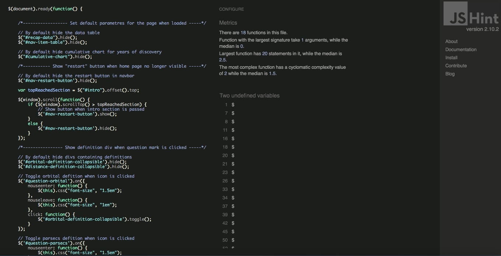
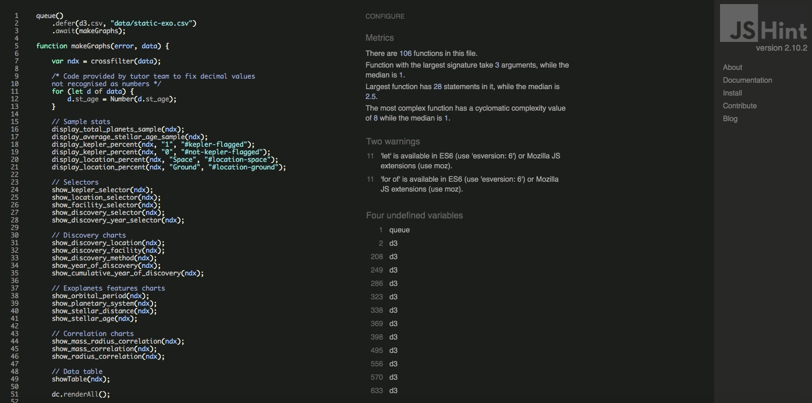

# JavaScript testing

This section documents manual and semi-manual testing that was done on JS files for this project. 

## Script.js testing

This section documents the manual tests that were performed on the [script.js](../../static/js/script.js) file. 

This file uses jQuery to simplify DOM manipulation mostly to handle interactions with user input through the modal form. 

### Code Quality

[script.js](../../static/js/script.js) was passed through [JSHint](https://jshint.com/) by direct input to check for any issues in the JS code such as compatibility.

You can find below the output of this code quality check. 2 undefined variables were identified but refer to external libraries:
- **"$"** as I used jQuery for DOM manipulation
- **"dc"** which is used to reset the charts when the "reset filter" button is clicked

No further issues were identified. 

### DOM Interaction testing

###### Testing case 1

*Check default DOM parametres when page has loaded*

Test scenario:
- Click on the refresh button of the browser and waits untill the page has fully loaded.
- The menu items in the navigation bar should display (in this specific order): home, discoveries, features and correlation. 
- Check that on the top right corner of the navigation bar there should only be one button "Reset Filters".
- Click on the "Start Here" button in the middle of the home page.
- A modal form should appears, check that:
    - the checkbox for "Data Table" is by default disabled
    - the checkbox for "Type of data is on "non-cumlative"
    - all correlations checkboxes should be enabled
- Close the modal form and got to the discovery section, check that the graph "detection per year" displays non-cumlative data. 

Test result: **Successful**

###### Testing case 2

*Testing the "restart" button*

Test scenario:
- Click on the refresh button of the browser and waits untill the page has fully loaded.
- Scroll down to the intro section, so that the home page is passed.
- A black "Restart Here" button on the top right corner of the navigation bar should appear next to the white "Reset Filters" button.
- When you click this button, the modal form should reopen.
- Scroll back to the top of the page (up to home section), the button should dispappear from the navigation bar.

Test result: **Successful**

###### Testing case 3

*Testing icon definition*

Test scenario:
- Click on the refresh button of the browser and waits untill the page has fully loaded.
- Go to discovery section and click on the question mark icon next to the title of the graph "detection method" (3rd graph of this section).
- Click the icon and check that you are being redirected to a wikipedia page in a new tab that provides you information on detection methods for exoplanets.
- Go to features section and click on the question mark icon next to the title of the graph "orbital period", a paragraph with a short definition should appear below the title.
- Click again on the question mark icon and the definition should disappear. 
- Follow the same steps for the "distance to the planetary system" graph, you should be able to toggle hide/show a definition for the 'parsecs' unit of measure. 

Test result: **Successful**

###### Testing case 4

*Testing the modal form interaction with the DOM*

Hypothesis: The user should go to the modal form either by clicking the "Start Here" button on the home page or the "Restart Here" button in the navigation bar.

Test scenario:
- in the modal form, perform the following tests:
- 1st part:
    - enable the "Data Table" checkbox and exit modal form
    - a new menu item in the navigation bar "Data Table" should have appeared
    - click it to get to the section and check that the table is appearing properly
    - double check that when you re-enter the modal form, and disable the "Data Table", the section and menu item should disappear
- 2nd part:
    - tick the "Type of Data" checkbox to cumulative and exit modal form
    - scroll down to the "detections per year" graph and check that the data are now on a cumulative basis
    - double check that when you re-enter the modal form, and put the data back to non-cumulative, the graph is back to displaying non-cumlative data
- 3rd part:
    - in the "Correlations Data" section of the modal form (at the very bottom), disable the first scatter plot "Mass vs. Radius Planet"
    - exit modal form and check in the correlation section that this corresponding scatter plot is no longer displayed in the dashboard
    - perform the same test for the other two scatter plots
    - check that when you disable the three correlations graphs in the modal form, the correlation section is no longer visible in the navigation bar and the dashboard
    - double check that when you re-enter the modal form, and enable the correlations graphs, the section should reappears in the navigation bar as well as the three scatter plots in the correlation section. 

Test result: **Successful**

###### Testing case 5

*Setting reset filters button*

Hypothesis: the user already applied specific filters to the dashboard either through the modal form or by directly clicking on the charts.

Test scenario:
- Open the modal form by clicking on the "Start Here" button of the home page.
- Put the following parameters:
    - click checkbox to enable data table
    - click checkbox to cumulative data
    - disable at least one of the correlation graphs 
    - add at least one filter by selecting a criteria on the sample
- Click on the "Reset Filters" button at the bottom of the modal form and check that the form is back to its default parametres (as described in test case 1). The dashboard should display the data for the entire sample.
- Follow the same steps but instead of clicking the "Reset Filters" button directly from the modal form, clicks the "Reset Filters" button from the navigation bar. The outcome should be the same. 

Test result: **Successful**

## Graphs.js testing

This section documents all the manual tests that were performed on the [graphs.js](../../static/js/graphs.js) file. 

### Code Quality

[graphs.js](../../static/js/graphs.js) was passed through [JSHint](https://jshint.com/) by direct input to check for any issues in the JS code such as compatibility.

You can find below the output of this code quality check. 

4 undefined variables were identified but refer to external libraries:
- **"queue"** is used to load the data
- **"crossfilter"** is used for handling the dataset
- **"d3"** is used for data vizualisation
- **"dc"** is used to leverage on d3

There were two warnings highlighted by JS Hint regarding the use of new ES6 syntax:
- 'let' is available in ES6 (use 'esversion: 6') or Mozilla JS extensions (use moz).
- 'for of' is available in ES6 (use 'esversion: 6') or Mozilla JS extensions (use moz).

To fix this, I decided to change the use of "let" by "var" and then included the following comment at the beginning of my file: " // jshint esversion: 6 " for the second warning. 

No further issues were mentioned apart from an unused variable that was created only for testing purposes but that was then commented out. 

### Data consistency testing

For this section, I am going to go through each functions that are used to create data vizualisation and check their consistency using my testing file (using excel) that you can access [here](PATH TO ADD). 

I have indeed used this excel file to write my code and build graphs incrementally throughout this project. 

To simplify this testing protocol and prevent from missing any issues, I will follow the same order as my code is written in this file.

**Important notes on how to use this file:**
- The file is organized by tabs, each corresponding to testing the different section of the data dashboard by recreating the same graphs with excel. 
- The first tab is dedicated to testing the consistency of the data at sample level but is also used to test the selectors within the modal form. 
- The other tabs refer to each graphs in the data dashboard and are arranged by order of appearance within the website. Example: "pie chart 1" tab refers to the first pie chart in the dashboard which is the "discovery location" chart. 
- I tried to automate as much as Excel would allow me by using pivot tables and pivot charts. But sometimes the use of custom dimension forced me to build the graphs manually in excel. 

#### Helper functions

TRY AND AUTOMATE THIS PART USING JASMINE

###### function remove_blanks

Manual testing 
Try Jasmine but might fail

###### function show_slice_percent

Jasmine
  
###### function accumulate_group

manual testing -> function succesfully tested later 

###### function convert_string_to_float

Jasmine

#### Selectors to filter charts

Please find below the instance of a test scenario that was used to check the consistency of data when filtering them using the modal form. To avoid repetition in this file, the test scenario is detailed below for the "show_kepler_selector" function, but all functions used to filter the sample went through the exact same testing procedure. 

###### function show_kepler_selector

**Test scenario:**
- In the website open the modal form, in the dropdown box for "Kepler selector", select "Exclude Kepler Scope". 
- Close the form and compare the "total number of exoplanets" displayed in the intro section (stats on our sample) with the "count of pl_name" in the "Data sample" tab of the testing file after applying filtering on 0 "pl_kepflag". 
- Follow the same steps to check the number of exoplanets that are within the Kepler scope. 
- Figures should be consistent and should add up to the total number of exoplanets in the sample (ie. 3972). 

Test result: **Successful**

Same test scenario was applied to test the following functions and they were all succesfull. 
- function show_location_selector 
- function show_facility_selector 
- function show_discovery_selector
- function show_discovery_year_selector
 
#### Sample Satistics

###### function display_total_planets_sample

The data source contains 3972 rows which correspond to the instances of the 3972 discovered exoplanets in the file. This can easily be checked by comparing the number of exoplanets displayed in the data dashboard ("stats on our sample" in the intro section) when no filter is applied and the "count of pl_name" in the "Data sample" tab of the excel testing file. 

###### function display_average_stellar_age_sample

This function displays the average stellar age and can be checked by comparing the age displayed in the data dashboard with the one that can be found in the first tab of the testing file. For the whole sample, the average age is consistent and succesfully displays 4.18. Other sanity checks can be performed by adding filters and turn out to be all consistent. 

Please note I struggled a bit with this function, at first my custom reducer was incorrectly passing the "initialize", "add_item" and "remove_item" functions causing a "NaN" issue as the average value could not be accessed. I also then realised that the value for the average stellar age was way below the expected value of 4.18 Gyr for the whole sample. Thanks to the tutor team I was able to correct this issue by first parsing the data to avoid issues with floating point numbers, but also by adding an "if" statement so that null values are not accounted for. This was causing a huge difference as there were a lot of missing data for stellar age (2006 planets were missing that information). 

###### function display_kepler_percent

This function displays the percentage of exoplanets that were discovered (or not) during the famous Kepler mission. 

As it was done for the previous functions, the % displayed in the data dashboard can be checked using testing file. In the "Data sample" tab, we see that the attribution of exoplanets detection percentages match the ones in the dashboard (50.2% within Kepler scope vs. 40.8% outside Kepler scope). 

###### function display_location_percent

Same as the function before, the attribution of exoplanets detection can be checked using the first tab of the testing file and results are consistent. 

#### Discovery charts

###### show_discovery_location
    
**Test scenario:**
- In the website, refer to the first pie chart named "discovery location". 
- Go to the "pie chart 1" tab of the testing file and compare the two graphs, they should be identical. 
- You can also perform additional sanity checks by adding filters to the sample.
 
Test result: **Successful**

###### show_discovery_facility

cf. tab "pie chart 2" in the testing excel file

This chart was tested following the same steps as the test scenario detailed above. Please note that for this chart, I manually built a second chart to be have a sanity check for the "Others" since I used the "slicesCap(8)" method to avoid unreadable clustering. 

For all the functions below, the same procedure was followed as well and all the graphs displayed in the dashboard were consistent with the testing file.  

###### show_discovery_method

cf. tab "row chart 3" in the testing excel file

**Note:** The three following detection methods are flagged under the same label "Timing Variations": 
- "Eclipse Timing Variations"
- "Transit Timing Variations"
- "Pulsar Timing"
- "Pulsation Timing Variations"
Those 4 detection methods should add up (in the testing excel file) to the "Timing variations" in the data dashbaord. 

###### show_year_of_discovery

cf. tab "bar chart 4.2" in the testing excel file

###### show_cumulative_year_of_discovery

cf. tab "bar chart 4.2" in the testing excel file

#### Features charts

Please find below the instance of a test scenario that was used to check charts for the features section. To avoid repetition, the test scenario is detailed below for the "show_orbital_period" function, but all other charts were tested following the same procedure.

Also please note that for all the bar charts of this section, I could not use pivot charts since I used custom dimension to sort the data by intervals. Those charts were therefore built "manually" in Excel. 

###### show_orbital_period

**Test scenario:**
- In the website, refer to the first bar chart of the features section named "orbital period"
- Go to the "bar chart 5" tab of the testing file and compare the two graphs, they should be identical. 
- Check that the "Grand Total" matches the total number of planets in the sample. 

Test result: **Successful**

###### show_planetary_system

cf. tab "line chart 6" in the testing excel file

###### show_stellar_distance

cf. tab "bar chart 7" in the testing excel file

###### show_stellar_age

cf. tab "bar chart 8" in the testing excel file

#### Correlation charts
    
Please find below the instance of a test scenario that was used to test the scatter plots. To avoid repetition, the test scenario is detailed below for the first correlation "show_mass_radius_correlation" function, but the other scatter plots were tested following the same procedure. 

Please note that the scatter plots within the excel testing files were set to prevent from plotting any points for which we were missing at least one of the two dimensions. This can be checked by right-clicking on the scatter plot, then select "Select Data...", at the bottom of the window we see "Show empty cells as gaps". In the dashboard, I used the "remove_blanks" function to avoid this issue, otherwise it would plot empty values as zero and we don't want that.

###### show_mass_radius_correlation

**Test scenario:**
- In the website, refer to the first scatter plot of the correlation section named "mass vs. radius of the planet"
- Go to the "scatter plots 1" tab of the testing file. The x-axis and y-axis were intentionally left to default.
- You should notice two plots flagged in red, those two plots should be the only ones missing from the scatter plot in the dashboard.
- In the dashboard, the domain for the y-axis (planet radius) was manually set to 25 to increase readibility of the graph. 
- In the pivot table on the right of the scatter plot, still in the testing file:
    - for "pl_masse" deselect "(blank)" data 
    - for "pl_rade" deselect "(blank)" data and data > 25
- There should only be 2 counts in "Count of pl_name" which corresponds to the data flagged in red. 

Test result: **Successful**

###### show_mass_correlation

cf. tab "scatter plots 2" in the testing excel file

For this scatter plot, we notice one plot is flagged in red and really stands out from the rest of the data. Indeed, for this specific planet, the stellar mass is 23.56 times the solar mass, whereas for the rest of the sample, stellar masses are all between 0 and 5. The domain for the y-axis, stellar mass, was therefore set manually to a max of 4.5 which corrects "outlier" effect in the sample. 

###### show_radius_correlation

cf. tab "scatter plots 3" in the testing excel file

As it was done in the first scatter plot, the maximum for the planet radius (now in the x-axis) is set to 25, only excluding one point with (planet radius = 39.79) from plotting. 

#### Data table

###### function showTable

**Test scenario:**
- In the website, open the modal form, enable "Data Table" and in the "discovery method" dropdown menu, select "Astrometry". 
- Close the modal form and go to the "Data Table" section, you should have only one planet for this detection method. 
- In the testing excel file, go to "static-exo" tab and in the "F" column labelled "pl_discmethod", add filter and select as well "Astrometry".
- Compare the data in the dashboard table and in the excel file, everything should be identical. 
- Please find below corresponding fields for the excel file (if necessary):
    - Hosting stellar name: "pl_hostname"
    - Year of discovery: "pl_disc"
    - Discovery method: "pl_discmethod"
    - Orbital period: "pl_orbper"
    - Stellar distance: "st_dist"
    - Stellar age: "st_age"

Test result: **Successful**